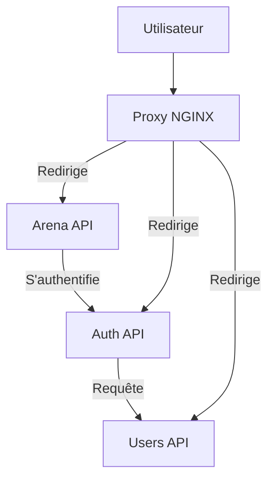

# Poke-fu-mi



## Configuration

### Initialisation des bases de données SQLite

1. Dans le dossier `users-api`, créez un fichier `users.db`
2. Dans le dossier `arena-api`, créez un fichier `arena.db`

### Création de la clé RSA de chiffrement des tokens JSONWebToken

1. Dans le dossier `auth-api`, exécutez la commande suivante :

```bash
openssl genrsa -out private.pem 4096
```

La taille de la clé (4096 Ko) peut être réduite à 2048 Ko si nécessaire (consommation CPU trop élevée par exemple).

### Exécution de l'environnement

#### Avec Docker Compose

Exécutez la commande suivante à la racine
```bash
docker compose up -d
```

### Avec Docker

Dans chaque dossier API, construisez les images Docker à l'aide de la commande suivante :

```bash
docker build -t [service]:latest .
```

Vous pourrez ensuite exécuter les services avec la commande `docker run` accompagnée des paramètres de volumes et de ports appropriés aux configurations.

## Architecture

L'application se découpe en 3 micro-services différents, ayant chacun un rôle précis :
- Arena : API de gestion des matches
- Auth : API de gestion de l'authentification (autorité de certification)
- Users : API de gestion des utilisateurs

Chaque micro-service dispose de sa propre base de données, à l'exception de Auth qui s'appuie sur Users afin d'apporter un mécanisme de génération de tokens JSONWebToken (JWT)

L'architecture est aussi composé d'un serveur de front (nginx) qui redirige les requêtes vers les micro-services correspondants, il agit en tant que Reverse Proxy.

## Choix techniques

L'API Arena aurait pu être découpée en API Match, API Round et API Deck, ainsi qu'une API Pokemon wrappant l'API publique liée, mais en raison de leur trop grand nombre d'interactions respectives, il a été convenu que l'ensemble soit factorisé en un seul service n'ayant qu'un unique propre : gérer la tenue de matches. D'un point de vue Site Reliability Engineering et DevOps, de part l'intrication de ses composantes, l'API Arena peut être mise à l'échelle en un bloc.

L'API Users ne sert qu'à gérer les utilisateurs.

L'API Auth a pour unique but de communiquer avec l'API Users et d'encapsuler la donnée dans des tokens JWT, permettant une architecture distribuée sans noeud cental, à savoir, sans base de données congestionnée par les requêtes (nombreuses) des différentes API cherchant à authentifier les utilisateurs.

## Implémentation

Toutes les US ont été réalisées à l'exception de celles liées à la jouabilité du jeu, qui, en raison de sa nature algorithmique pure, n'a pas été retenue lors du développement par faute de temps.

## Référence

### Mécanisme d'authentification

`POST /generate` - Génération d'un token d'authentification
- Corps :
    - username : string
    - password : string
- Headers :
    - Content-Type : `application/json`
- Réponse :
    - token : `JSONWebToken`
- Codes de retour : `201 Created`, `403 Forbidden`

`POST /verify` - Vérification d'un token d'authentification
- Corps :
    - token : `JSONWebToken`
- Headers :
    - Content-Type : `application/json`
- Réponse : `200 OK`, `403 Forbidden`
- Cookie : `access-token` (expiration 30 jours)

Pour s'identifier auprès des autres API, inclure l'un des éléments suivants dans vos requêtes :

- `Authorization: Bearer <token>`
- `Cookie: access-token=<token>` (`include: same-origin`)

### API Users

`GET /users` - Liste des utilisateurs

- Authentification requise
- Réponse :
    - users : `User[]` (mot de passe exclu)
        ```json
        [
            {
                "id": "ac3e9586-0074-4bce-a379-54377dccc7b1",
                "name": "toto",
                "score": 0,
                "admin": false
            }
        ]
        ```
- Codes de retour : `200 OK`, `403 Forbidden`

`GET /:id` - Détail d'un utilisateur

- Authentification requise
- Paramètres :
    - id : string (UUIDv4)
- Réponse :
    - user : `User` (mot de passe exclu)
        ```json
        {
            "id": "ac3e9586-0074-4bce-a379-54377dccc7b1",
            "name": "toto",
            "score": 0,
            "admin": false
        }
        ```
- Codes de retour : `200 OK`, `403 Forbidden`

`POST /` - Inscription d'un utilisateur

- Accès visiteur uniquement (Bearer Token vide et pas de cookie `access-token`)
- Corps :
    - name : string
    - password : string
- Réponse vide
- Codes de retour : `201 Created`, `500 Internal Server Error`

`POST /check` - Vérification d'une combinaison nom d'utilisateur et mot de passe

- Accès visiteur uniquement (Bearer Token vide et pas de cookie `access-token`)
- Corps :
    - name : string
    - password : string
- Réponse vide
- Codes de retour : `200 OK`, `403 Forbidden`

### API Arena

#### Matches

`GET /match` - Liste des matches

- Authentification requise
- Réponse : `Match[]`
  ```json
  [
      {
          "id": "3b9dcb29-c0c3-4f38-9541-d75320702e83",
          "challenger_id": "c9f53ad3-4369-49c2-a938-9f399f327d7e",
          "challengee_id": "37679e63-5cfe-4408-8a18-6355cc80dcc6",
          "challengee_date": null,
          "started": false,
          "winner_id": null
      }
  ]
  ```
- Codes de retour : `200 OK`, `403 Forbidden`

`GET /match/:id` - Détail d'un match

- Authentification requise
- Paramètres :
    - id : string (UUIDv4)
- Réponse : `Match`
    ```json
    {
        "id": "3b9dcb29-c0c3-4f38-9541-d75320702e83",
        "challenger_id": "c9f53ad3-4369-49c2-a938-9f399f327d7e",
        "challengee_id": "37679e63-5cfe-4408-8a18-6355cc80dcc6",
        "challengee_date": null,
        "started": false,
        "winner_id": null
    }
    ```
- Codes de retour : `200 OK`, `403 Forbidden`

`POST /match` - Création d'un match

- Authentification requise
- Corps :
    - challengee : string (UUIDv4 d'un utilisateur)
- Codes de retour : `201 Created`, `403 Forbidden`

`GET /match/invite` - Liste des invitations pour un utilisateur

- Authentification requise
- Réponse : `Match[]`
  ```json
  [
      {
          "id": "3b9dcb29-c0c3-4f38-9541-d75320702e83",
          "challenger_id": "c9f53ad3-4369-49c2-a938-9f399f327d7e",
          "challengee_id": "37679e63-5cfe-4408-8a18-6355cc80dcc6",
          "challengee_date": null,
          "started": false,
          "winner_id": null
      }
  ]
  ```
- Codes de retour : `200 OK`, `403 Forbidden`

`PUT /match/invite/:id` - Acceptation d'une invitation

- Authentification requise
- Paramètres :
    - id : string (UUIDv4 d'un match invité)
- Codes de retour : `200 OK`, `403 Forbidden`

#### Decks

`GET /deck` - Liste des decks

- Authentification requise
- Réponse : `Deck[]`
  ```json
  [
      {
          "id": "3b9dcb29-c0c3-4f38-9541-d75320702e83",
          "user_id": "c9f53ad3-4369-49c2-a938-9f399f327d7e",
          "match_id": "3b9dcb29-c0c3-4f38-9541-d75320702e83",
          "pokemon_id": 1,
          "played": false
      }
  ]
  ```
- Codes de retour : `200 OK`, `403 Forbidden`

`GET /deck/:match` - Liste des decks d'un match
- Authentification requise
- Paramètres :
    - match : string (UUIDv4 d'un match)
- Réponse : `Deck[]`
    ```json
    [
        {
            "id": "3b9dcb29-c0c3-4f38-9541-d75320702e83",
            "user_id": "c9f53ad3-4369-49c2-a938-9f399f327d7e",
            "match_id": "3b9dcb29-c0c3-4f38-9541-d75320702e83",
            "pokemon_id": 1,
            "played": false
        }
    ]
    ```
- Codes de retour : `200 OK`, `403 Forbidden`

`POST /deck` - Création d'un deck

- Authentification requise
- Corps :
    - match : string (UUIDv4 d'un match)
    - pokemon : string|number (nom ou ID Pokémon API d'un Pokémon)
- Codes de retour : `201 Created`, `403 Forbidden`

#### Rounds

`POST /round` - Jouer un combat

- Authentification requise
- Corps :
    - match : string (UUIDv4 d'un match)
    - deck : string (UUIDv4 d'un deck)
- Réponse : TODO
- Codes de retour : `200 OK`, `403 Forbidden`

`GET /round/:match` - Liste des rounds d'un match

- Authentification requise
- Paramètres :
    - match : string (UUIDv4 d'un match)
- Réponse : `Round[]` (TODO)
- Codes de retour : `200 OK`, `403 Forbidden`

