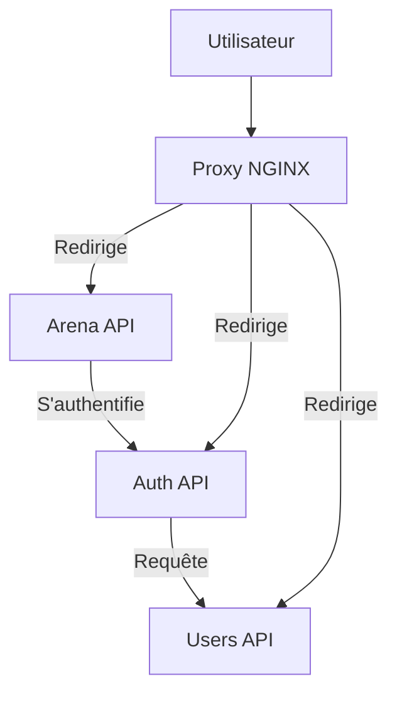

# Poke-fu-mi

## Architecture

L'application se découpe en 3 micro-services différents, ayant chacun un rôle précis :
- Arena : API de gestion des matches
- Auth : API de gestion de l'authentification (autorité de certification)
- Users : API de gestion des utilisateurs

Chaque micro-service dispose de sa propre base de données, à l'exception de Auth qui s'appuie sur Users afin d'apporter un mécanisme de génération de tokens JSONWebToken (JWT)

